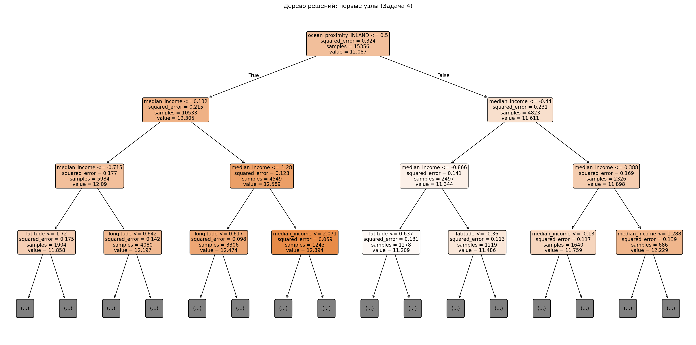
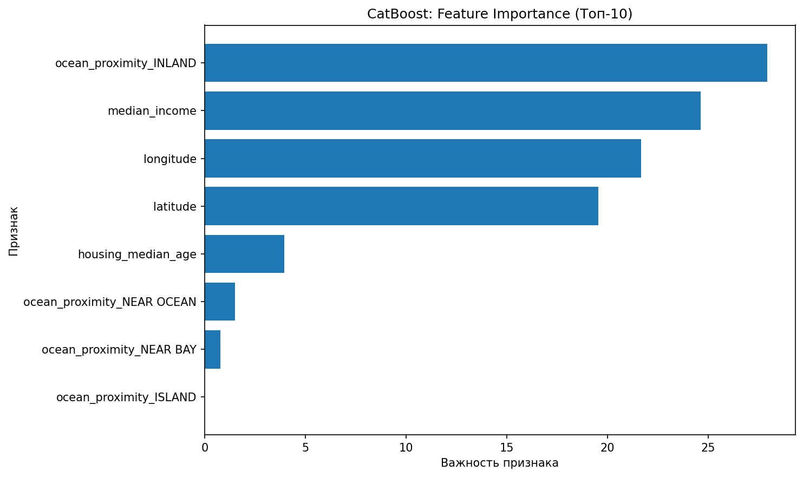
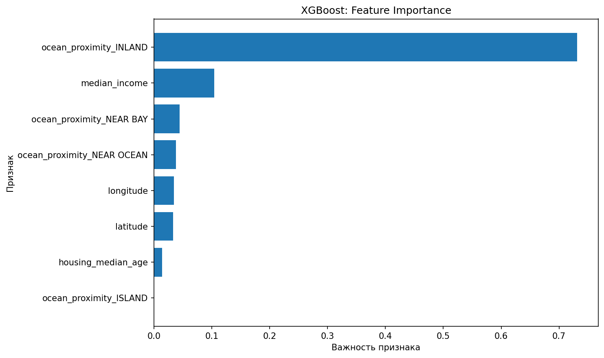
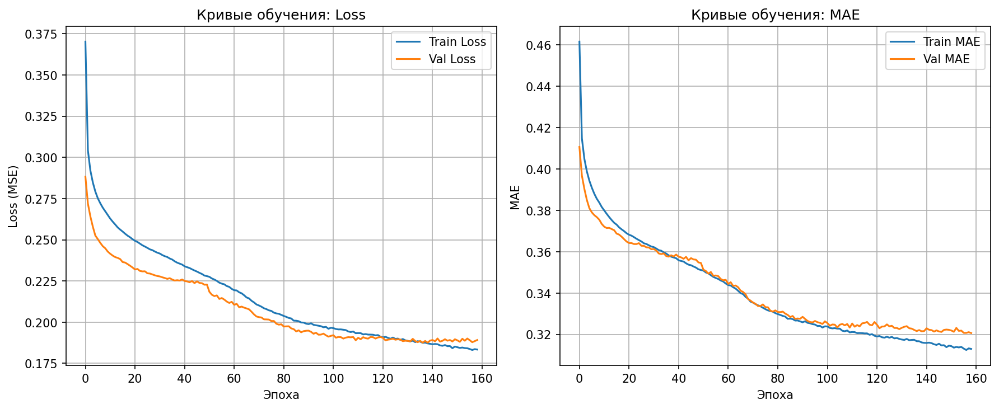
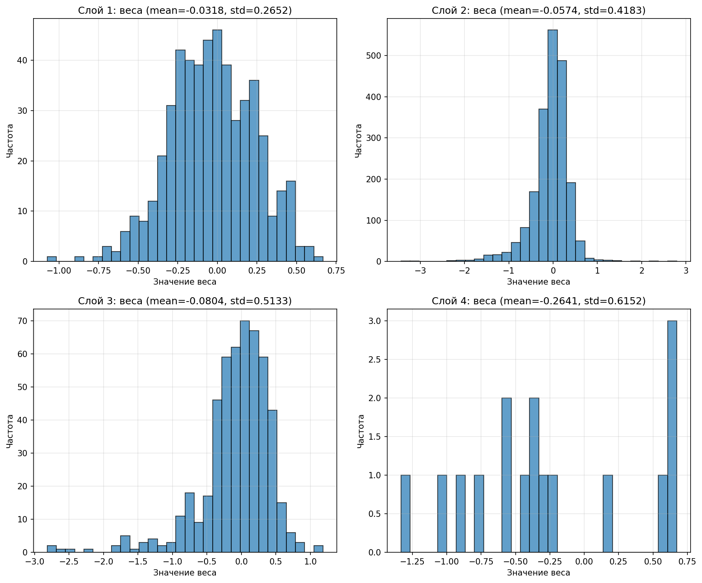

# Лабораторная работа №1-2: Методы ИИ. EDA. Регрессионные модели

## Цель работы
Получение навыков анализа первичных данных (EDA), определения влияния признаков, понимания архитектур моделей (линейная регрессия, дерево решений, CatBoost, XGBoost, MLP) и разработки воспроизводимого пайплайна на Python с использованием DVC.

---

## Задача 1: EDA и выбор признаков
**Датасет:** California Housing (`housing.csv`), ~19 195 строк, 10 столбцов.  
**Целевая переменная:** `median_house_value` (тип задачи: регрессия).

### 🔍 Ответы на вопросы анализа
| Вопрос | Ответ |
|--------|-------|
| **Какие признаки использованы и почему?** | `median_income`, `longitude`, `latitude`, `housing_median_age`, `ocean_proximity`. Оставлены признаки с высокой корреляцией с целевой переменной и логической значимостью для стоимости жилья. |
| **Какие признаки исключены и почему?** | `total_rooms`, `total_bedrooms`, `households`, `population`. Исключены из-за низкой важности в предварительной оценке (Random Forest) и высокой корреляции друг с другом (мультиколлинеарность). |
| **Как преобразованы признаки?** | Числовые: `StandardScaler` (для стабилизации градиентов). Категориальные: `One-Hot Encoding` (`ocean_proximity`). Целевая: `np.log1p()` (устранение правосторонней асимметрии распределения цен). |
| **Значимость признаков** | Предварительная оценка через Random Forest показала доминирование `median_income` и географических координат. Окончательная значимость подтверждена на этапах 5-6. |

### Вывод по EDA
Датасет требует обработки пропусков и кодирования категориальных признаков. Распределение целевой переменной скошено вправо, что обосновывает логарифмическую трансформацию. Выбранные признаки покрывают экономические, географические и структурные факторы стоимости жилья.

---

## Задача 2: DVC-пайплайн
Построен воспроизводимый пайплайн в файле `dvc.yaml`. Этапы:
- `prepare` → загрузка, очистка, масштабирование, OHE, логарифмирование target
- `train_linear` → линейная регрессия
- `train_decision_tree` → дерево решений
- `train_catboost` → CatBoost
- `train_xgboost` → XGBoost
- `train_mlp` → многослойный перцептрон

При изменении `params.yaml` или `data/raw/housing.csv` DVC автоматически пересчитывает зависимые этапы. Конфигурация вынесена в `params.yaml`.

---

## Задача 3: Линейная регрессия
| Метрика | Значение |
|---------|----------|
| MAE     | 0.2637   |
| RMSE    | 0.3447   |
| R²      | 0.6402   |

**Веса признаков (топ-3 по модулю):**
- `median_income`: +0.3108 (рост дохода → рост цены)
- `latitude`: -0.3093 (севернее → дешевле)
- `longitude`: -0.3021 (восточнее → дешевле)

Модель служит базовым бейзлайном. Чувствительна к линейности зависимостей.

---

## Задача 4: Дерево решений
| Метрика | Значение |
|---------|----------|
| MAE     | 0.2606   |
| RMSE    | 0.3419   |
| R²      | 0.6460   |

Параметры: `max_depth=4`, `min_samples_split=20`.  
  
Первый разделяющий признак — `median_income`, что подтверждает его доминирующее влияние.

---

## Задача 5: CatBoost
| Метрика | Значение |
|---------|----------|
| MAE     | 0.1719   |
| RMSE    | 0.2400   |
| R²      | 0.8256   |

  
Наиболее значимые признаки: `ocean_proximity_INLAND` (27.9%), `median_income` (24.6%), `longitude` (21.7%). Модель эффективно уловила нелинейные географические паттерны.

---

## Задача 6: XGBoost
| Метрика | Значение |
|---------|----------|
| MAE     | 0.1608   |
| RMSE    | 0.2304   |
| R²      | 0.8392   |

  
Доминирующий признак: `ocean_proximity_INLAND` (73.1%). Градиентный бустинг показал наилучшую обобщающую способность за счёт последовательного исправления ошибок слабых деревьев.

---

## Задача 7: Нейронная сеть (MLP)
| Метрика | Значение |
|---------|----------|
| MAE     | 0.1896   |
| RMSE    | 0.2625   |
| R²      | 0.7912   |

Архитектура: `Input → Dense(64) → Dense(32) → Dense(16) → Dense(1)`.  
Обучение остановлено на 159 эпохе (EarlyStopping, `patience=20`).

  
  

**Интерпретация весов:** Все 4 слоя показали стабильное распределение (`std` от 0.26 до 0.61). Отсутствие экстремальных значений свидетельствует об устойчивом градиентном спуске и отсутствии взрывов/исчезновений градиентов.

---

## Задача 8: Вычислительный граф DVC
 
Граф подтверждает, что все модели обучаются на идентично предобработанных данных. Полный визуальный граф сохранён в `reports/dvc_graph.png`.

---

## Задача 9: Сводная таблица метрик и выбор лучшей модели

| Модель              | MAE    | RMSE   | R²     |
|---------------------|--------|--------|--------|
| Линейная регрессия  | 0.2637 | 0.3447 | 0.6402 |
| Дерево решений      | 0.2606 | 0.3419 | 0.6460 |
| CatBoost            | 0.1719 | 0.2400 | 0.8256 |
| **XGBoost**         | **0.1608** | **0.2304** | **0.8392** |
| Нейронная сеть (MLP)| 0.1896 | 0.2625 | 0.7912 |

**Лучшая модель:** `XGBoost`  
**Причины превосходства:**
1. Градиентный бустинг последовательно минимизирует остаточные ошибки, что даёт преимущество на табличных данных.
2. Устойчив к масштабу признаков и выбросам.
3. Эффективно комбинирует слабые деревья, улавливая сложные нелинейные зависимости между локацией, доходом и ценой.
4. MLP уступил из-за недостаточного объёма данных для глубокой архитектуры и необходимости тщательного подбора гиперпараметров.

---

## Задача 10: Итоговый вывод
В ходе работы выполнены все этапы машинного обучения: от EDA и инженерии признаков до обучения пяти регрессионных моделей и построения воспроизводимого DVC-пайплайна. Полученные результаты подтверждают, что для задач прогнозирования стоимости жилья на табличных данных ансамблевые методы на основе градиентного бустинга (XGBoost, CatBoost) значительно превосходят линейные модели и простые нейронные сети. Внедрение DVC обеспечило прозрачность, версионирование данных и автоматизацию пересчёта пайплайна, что критически важно для production-ML.

---

## 🛠 Как воспроизвести результаты
```bash
# 1. Клонировать репозиторий
git clone <URL_ВАШЕГО_РЕПОЗИТОРИЯ>
cd LB1

# 2. Создать и активировать окружение
python -m venv venv
venv\Scripts\activate  # Windows
# source venv/bin/activate  # macOS/Linux

# 3. Установить зависимости
pip install -r requirements.txt

# 4. Запустить весь пайплайн DVC
dvc repro

# 5. Посмотреть метрики
cat metrics/summary_metrics.md